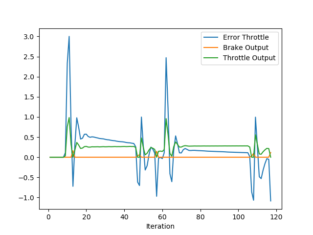
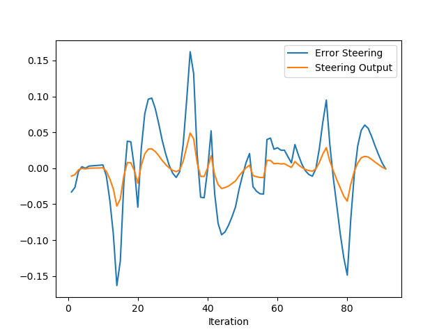
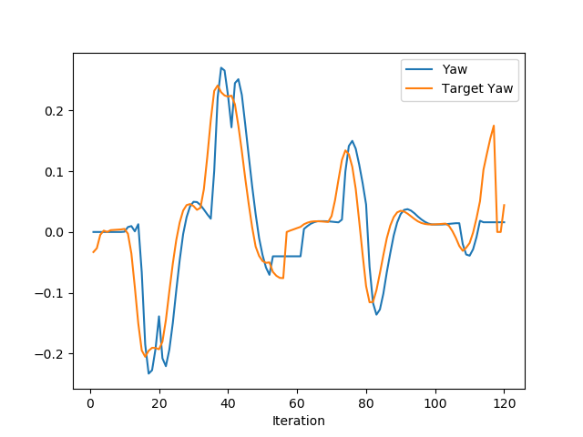

# Control and Trajectory Tracking for Autonomous Vehicle

## Table of contents

- [Project overview](#project-overview)
- [Dependencies](#dependencies)
- [Instructions](#instructions)
- [Report](#report)


# Project overview

In this project, you will apply the skills you have acquired in this course to design a Proportional-Integral-Derivative (PID) controller to perform vehicle trajectory tracking. Given a trajectory as an array of locations, and a simulation environment, you will design and code a PID controller and test its efficiency on the CARLA simulator used in the industry.

# Dependencies

The state code in this repository is aligned to run on the Udacity VM workspace. Refer to the classroom page **Ubuntu VM Workspace - Overview** to learn how to access the VM workspace and its restrictions and best practices. 

However, to set up your local machine with the necessary tools, you must have either *Windows Subsystem for Linux* (WSL) or *Ubuntu 20.04* or *18.04 LTS*. Below is the list of tools installed in the Udacity VM workspace that you should install on your local machine.

- [CARLA simulator 0.9.9.4](https://github.com/carla-simulator/carla/releases/tag/0.9.9). <br/>
    You can find more details at [CARLA Quick Start Installation](https://carla.readthedocs.io/en/latest/start_quickstart/). The deb installation is the easiest way to get the latest release in Linux.
    ```bash
    sudo apt-key adv --keyserver keyserver.ubuntu.com --recv-keys 1AF1527DE64CB8D9
    sudo add-apt-repository "deb [arch=amd64] http://dist.carla.org/carla $(lsb_release -sc) main"
    sudo apt-get update # Update the Debian package index
    sudo apt-get install carla-simulator=0.9.10-2 
    ```

    The installation directory must be **/opt/carla-simulator/** on your Linux machine. To verify, open a terminal an launch CARLA as:
    ```bash
    cd /opt/carla-simulator
    ./CarlaUE4.sh
    ```
    The Carla Simulator should launch in a few seconds. You can close it after verification. 


- [NICE DCV Server](https://docs.aws.amazon.com/dcv/latest/adminguide/setting-up-installing-linux-prereq.html). <br/>
    This includes the Nvidia drivers along with CUDA libraries for the underlying Tesla T4 GPU.

    ```bash
    Sat Oct 14 15:31:45 2023       
    +---------------------------------------------------------------------------------------+
    | NVIDIA-SMI 535.104.12             Driver Version: 535.104.12   CUDA Version: 12.2     |
    |-----------------------------------------+----------------------+----------------------+
    | GPU  Name                 Persistence-M | Bus-Id        Disp.A | Volatile Uncorr. ECC |
    | Fan  Temp   Perf          Pwr:Usage/Cap |         Memory-Usage | GPU-Util  Compute M. |
    |                                         |                      |               MIG M. |
    |=========================================+======================+======================|
    |   0  Tesla T4                       On  | 00000000:00:1E.0 Off |                    0 |
    | N/A   31C    P0              27W /  70W |   2093MiB / 15360MiB |     27%      Default |
    |                                         |                      |                  N/A |
    +-----------------------------------------+----------------------+----------------------+
                                                                                            
    +---------------------------------------------------------------------------------------+
    | Processes:                                                                            |
    |  GPU   GI   CI        PID   Type   Process name                            GPU Memory |
    |        ID   ID                                                             Usage      |
    |=======================================================================================|
    |    0   N/A  N/A      1055      G   /usr/lib/xorg/Xorg                           67MiB |
    |    0   N/A  N/A      1521      G   /usr/lib/xorg/Xorg                           89MiB |
    |    0   N/A  N/A      1669      G   /usr/bin/gnome-shell                         23MiB |
    |    0   N/A  N/A      1948    C+G   /usr/lib/x86_64-linux-gnu/dcv/dcvagent      398MiB |
    |    0   N/A  N/A      3320      G   ...sion,SpareRendererForSitePerProcess       30MiB |
    |    0   N/A  N/A      4489    C+G   ...aries/Linux/CarlaUE4-Linux-Shipping     1348MiB |
    +---------------------------------------------------------------------------------------+
    ```


    ```bash
    dcv version
    # Output
    NICE DCV 2023.0 (r15487)
    Copyright (C) 2010-2023 NICE s.r.l.
    ```

- C++ 
    ```bash
    gcc --version
    # Output
    gcc (Ubuntu 9.4.0-1ubuntu1~20.04.2) 9.4.0
    ```
- Git
- [OpenCV](https://docs.opencv.org/4.x/d7/d9f/tutorial_linux_install.html)
- [CMake](https://askubuntu.com/questions/161104/how-do-i-install-make) and Make
- [VSCode](https://code.visualstudio.com/download)
- [Eigen Library for C++](https://eigen.tuxfamily.org/index.php?title=Main_Page)
- [Point Cloud Library](https://pointclouds.org/downloads/)
- Python3 and Pip v20.xx or above. 
    ```bash
    python3 --version
    # Output
    Python 3.8.10
    ```
- ROS

- Project specific dependencies
    ```bash
    # Required for building project
    sudo apt-get install -y libgoogle-glog-dev libgtest-dev
    # Required for running project. 
    # Install carla python package
    sudo python3 /usr/lib/python3/dist-packages/easy_install.py /opt/carla-simulator/PythonAPI/carla/dist/carla-0.9.9-py3.7-linux-x86_64.egg
    # Install python requirements
    pip install pandas matplotlib numpy pygame websocket-client
    ```

# Instructions
The sections ahead will guide you through the steps to build and run the project. 

## Step 1. Log into VM Workspace

Open the VM workspace and log into the VM to practice the current project. 
Once you log into the VM, open a Terminal window. 


## Step 2. Clone the Repository

Fork the repository to your Github account and clone the repository to the workspace using the commands below. 

```bash
git clone https://github.com/udacity/nd013-c6-control-starter.git
```

Change to the project directory.
```bash
cd nd013-c6-control-starter/project
```

## Step 3. Review the starter files
You will find the following files in the project directory.

```bash
.
├── cserver_dir
├── install-ubuntu.sh
├── manual_control.py
├── pid_controller/     # TODO Files
├── plot_pid.py
├── run_main_pid.sh
├── simulatorAPI.py
├── steer_pid_data.txt
└── throttle_pid_data.txt
```


## Step 4. Start the Carla Server
Start the Carla server by executing the following shell script. 
```bash
./run_carla.sh
```
This file will, in turn, execute the **/opt/carla-simulator/CarlaUE4.sh** script. 


## Step 5. Install Dependencies
Open another Terminal tab, and change to the **nd013-c6-control-starter/project**  directory. Execute the following shell script to install the project-specific dependencies. 
```bash
./install-ubuntu.sh
```
This file will install utilities such as, `libuv1-dev`, `libssl-dev`, `libz-dev`, `uWebSockets`. 


## Step 6. Update the Project Code

Change to the **pid_controller/** directory.
```bash
cd pid_controller/
```
Before you start coding, we strongly recommend you look at the rubric in your classroom, against which the human Mentor will review your submission. Your submission must satisfy all rubric criteria to pass the project; otherwise, the Mentor may ask you to re-submit. 


Update the following files as per the classroom instructions. You will TODO markers as well in these files. 

- **pid_controller.h**
- **pid_controller.cpp**
- **main.cpp**


> **Important**: At this moment, it is important to save your work and push it back to the remote Github repository. 


### Update Notes
In the previous version of the project starter code, we had **libcarla-install/** and **rpclib/** directories inside the **pid_controller/** directory. But, those directories are no longer needed in the current version of the starter code because the current **CMakeLists.txt** file has corresponding `includes` and `libs` added at `/opt/carla-source`.

To give some old context, when we had **rpclib/** directory inside the starter files, we used to compile the **rpclib** library using the following commands. 
```bash
cd pid_controller/
rm -rf rpclib
git clone https://github.com/rpclib/rpclib.git
```
This library is a **msgpack-rpc** library written using modern C++. The goal of building this library was to provide a simple RPC solution. However, all of the above-mentioned steps are **no longer needed** in the current version of the project strarter code. 


## Step 7. Build and Execute the Project

When you finish updating the project files, you can execute the project using the commands below. 

```bash
# Build the project
# Run the following commands from the pid_controller/ directory
cmake .
# The command below compiles your c++ code. Run it after each time you edit the CPP or Header files
make
```

```bash
# Run the project
cd ..
# Run the following commands from the nd013-c6-control-starter/project directory
./run_main_pid.sh
```
If the execution fails silently, you can use **ctrl + C** to stop, and try again. 

Another possible error you may get is `bind failed. Error: Address already in use`. In such a case, you can kill the process occupying the required port using the commands below.

```bash
ps -aux | grep carla
# Use the IDs displayed in the output of the last command. 
kill id     
```


## Step 8. Check the Rubric and Submit

Re-check the rubric in the classroom and ensure that your submission satisfies all rubric criteria to pass the project. Once you are confident, submit the project.


# Report

In this short report, the results of this project are described in addition to the code of this repository.


## Build the PID controller object

The PID controller object is defined in [pid_controller.h](project/pid_controller/pid_controller.h) and [pid_controller.cpp](project/pid_controller/pid_controller.cpp), and used in [main.cpp](project/pid_controller/main.cpp).


## Adapt the PID controller to the simulation

The PID controller is adapted to the simulation, first for the throttle and then for the steering.

### PID controller for throttle

The controller for the throttle is initialized as follows:
```cpp
PID pid_throttle = PID();
pid_throttle.Init(KP_THROTTLE, KI_THROTTLE, KD_THROTTLE, MAX_THROTTLE, MIN_THROTTLE);
```

The parameter values will be provided in the section [Evaluate and analyse the PID controller](#evaluate-and-analyse-the-pid-controller).  The corresponding velocity error was computed by the difference between the target velocity and the actual velocity.  The target velocity was chosen to be the velocity at the closest planned trajectory point:
```cpp
error_throttle = v_points[closest_idx] - velocity;
```


### PID controller for steering

The controller for the steering is initialized as follows:
```cpp
PID pid_steer = PID();
pid_steer.Init(KP_STEER, KI_STEER, KD_STEER, MAX_STEER, MIN_STEER);
```

The parameter values will be provided in the section [Evaluate and analyse the PID controller](#evaluate-and-analyse-the-pid-controller).  The corresponding steering error was computed by the difference between the target yaw and the actual yaw:
```cpp
error_steer = target_yaw - yaw;
```


The target yaw can be defined in various ways.  Three different options were tested:

- Version 1: this version was inadequate since the trajectory planning information contained in the closest trajectory point was insufficient to steer the vehicle in the right direction in a timely manner.
```cpp
target_yaw = angle_between_points(x_position, y_position, x_points[closest_idx], y_points[closest_idx]);
```

- Version 2: this version had the same problem than version 1, so that the delta between `x[closest_idx]` and `x[closest_idx+1]` did not provide sufficient information about the following trajectory.
```cpp
double target_yaw = angle_between_points(x_points[closest_idx], y_points[closest_idx], x_points[closest_idx+1], y_points[closest_idx+1]);

```

- Version 3: this version solved the previous problem by including the average direction of the trajectory via its start and end points.
```cpp
double target_yaw = angle_between_points(x_points[0], y_points[0], x_points[x_points.size()-1], y_points[y_points.size()-1]);
```


## Evaluate and analyse the PID controller

In this section, plots of the velocity and yaw as well as the respective errors are analyzed to evaluate the PID controller.  In addition, the questions of the instructions are answered.


### Analysis of the plots

The plots ot the velocity and yaw as well as the respective errors were used to tune the PID controllers, first for the throttle and then for the steering.  This order was chosen because the throttle was easier to tune than the steering due to the step-like nature of the target velocity.

For the throttle as well as the steering, a parametric analysis was carried out, first by adjusting the proportional (P) term and then by adjusting the integral (I) and derivative (D) terms.  For zero I- and D-terms, P was increased until moderate oscillations occured.  Then, the I-term was increased until the target level was more or less reached.  And finally, the D-term was increased to limit the oscillations.

After this initial controller tuning, the optimal parameters are the following, with the imposed limits:

| Controller |  P  |   I   |  D   | max | min |
|------------|-----|-------|------|-----|-----|
|  Throttle  | 0.3 |  0.01 | 0.01 |  1  | -1  |
|  Steering  | 0.3 | 0.001 | 0.01 | 1.2 |-1.2 |

In the following subsection, plots for the throttle and steering are shown with parameter variations respective to the previous values in order to illustrate the optimality of the previous parameters (in the context of this first analysis).


#### Throttle

- Influence of P (0.2, 0.3, 0.6): due to the step-like nature of the target velocity, the following figures illustrate quite well the influence of the P-parameter: if it is too small, the velocity only slowly reached the target speed.  If it is, however, too big, the velocity oscillates.  This behavior is also very well visible for in the error plots.  Finally, the first figure stops at about iteration 34 due to the collision with a vehicle, since the ego vehicle was not following sufficiently well the target trajectory.

<p float="left">
  
  
</p>
<p float="left">
  
  
</p>
<p float="left">
  
  
</p>


- Influence of I (0.001, 0.01, 0.1): the integral term allows to reduce the bias, when this term is neither too small not too big.
<p float="left">
  
  
</p>
<p float="left">
  
  
</p>
<p float="left">
  
  
</p>


- Influence of D (0.001, 0.01, 0.1): the derivative term has only a moderate influence in the considered range.  Further increasing its value leads to additional oscillations.

<p float="left">
  
  
</p>
<p float="left">
  
  
</p>
<p float="left">
  
  
</p>


#### Steering

- Influence of P (0.2, 0.3, 0.6): if the proportional term is too small, the steering is insufficient to dodge the car.  This is why a collision occurred in the first case around iteration 27.  If the porportional term is too big, the steering becomes too significant, so that the error increases.

<p float="left">
  
  
</p>
<p float="left">
  
  
</p>
<p float="left">
  
  
</p>


- Influence of I (0.0001, 0.001, 0.01): in the considered range, the integral parameter has a limited influence.  Increasing it to 0.01 led to a collision, which is why a futher analysis was not conducted.

<p float="left">
  
  
</p>
<p float="left">
  
  
</p>
<p float="left">
  
  
</p>


- Influence of D (0.001, 0.01, 0.1): in the considered range, the derivative parameter has a limited influence.  Decreasing its value to 0.001 led to a collision.

<p float="left">
  
  
</p>
<p float="left">
  
  
</p>
<p float="left">
  
  
</p>


### Questions

- **Could you explain the plots?** See above.

- **What is the effect of the PID according to the plots, how each part of the PID affects the control command?** The proportional component is tasked with guiding the output towards the reference. The derivative component serves as a reactive element, responsible for detecting variations in the reference. Lastly, the integration part aims to diminish the steady-state error.

- **How would you design a way to automatically tune the PID parameters?** The optimization of PID parameters can be carried out through the twiddle algorithm, a method that involves iteratively adjusting PID parameters based on the observation of total error. The algorithm allows for dynamic changes in the magnitude of adjustments, enabling fine-tuning during the optimization process.

- **Could you explain the pros and cons of a PID controller, in particular, a model free controller?** Its model-free characteristic, as indicated, offers the advantage of not requiring dynamic system modeling; instead, only the tuning of its gains is necessary. Moreover, its implementation is simpler when compared to alternative approaches. The challenge with linear PID control lies in its failure to consider certain nonlinearities within the system. Tuning its parameters can be difficult, and in some instances, achieving optimal performance becomes nearly impossible.

- **What would you do to improve the PID controller?** Potential enhancements involve incorporating an automatic parameter tuning method, as explained above, or simplifying the conditions, in which the parameters are tuned (in contrast to the example in carla).


### Video

A video with the (so far) optimal parameters is available [here](img/video.mp4).


